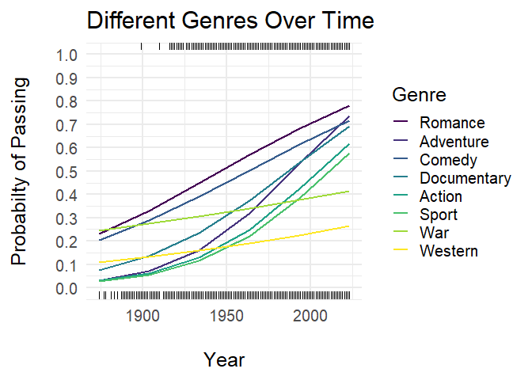
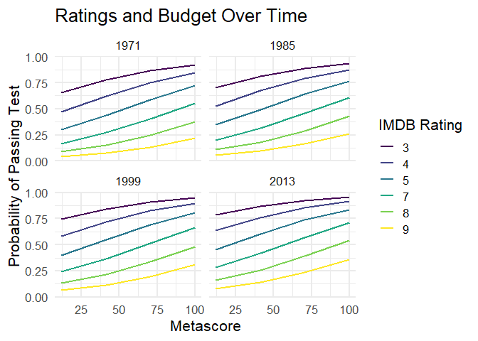

# Predicting Bechdel Test Results through Statistical Modeling


## Introduction

As we examine the portrayal of women’s roles in film, it is useful to
explore various criteria used to measure their representation. One
notable measure is the Bechdel Test, unintentionally introduced by
American cartoonist Alison Bechdel in 1986, and the primary measure of
women in film that is the focus of the present analysis. To pass the
test, the movie must contain two named women, who have a conversation
with each other that is not about a man. The Bechdel Test is a
straightforward and easy tool that allows people to quickly make base
assumptions about the presence of women in film. For this reason, this
project will be examining the characteristics of thousands of movies in
an attempt to use logistic regression analysis to model the likelihood
of passing the Bechdel Test.

## Data

The final data set used in the analysis was available through [IMDb
Non-Commercial
Datasets](https://developer.imdb.com/non-commercial-datasets/) and the
[Bechdel Test Movie List](https://bechdeltest.com/), containing 10,183
movie titles released from 1874 to 2023.

| tconst     | originalTitle     | startYear | runtimeMinutes | genres                  | rating |
|:-----------|:------------------|----------:|:---------------|:------------------------|-------:|
| tt27502426 | Les filles d’Olfa |      2023 | 107            | Documentary             |      3 |
| tt15398776 | Oppenheimer       |      2023 | 180            | Biography,Drama,History |      2 |
| tt15326988 | Ghosted           |      2023 | 116            | Action,Adventure,Comedy |      2 |
| tt8400584  | The Perfect Find  |      2023 | 99             | Comedy,Drama,Romance    |      3 |
| tt14230388 | Asteroid City     |      2023 | 105            | Comedy,Drama,Romance    |      3 |

The code manual for the data from IMDb:

- **tconst**: alphanumeric unique identifier of the title

- **originalTitle**: title of the movie

- **startYear**: release year of the movie

- **runtimeMinutes**: runtime in minutes

- **genres**: up to three genres associated with the title

- **rating**: Bechdel Test rating (0-3)

Other data used comes from the TidyTuesday social data project through
GitHub, found
[here](https://github.com/rfordatascience/tidytuesday/blob/master/data/2021/2021-03-09/readme.md).
This data set contains 1,794 movies ranging from 1970 to 2013.

| title          | year | imdb_rating | metascore | budget_2013 | binary |
|:---------------|-----:|------------:|----------:|------------:|:-------|
| Man of Steel   | 2013 |         7.4 |        55 |    2.25e+08 | PASS   |
| Nebraska       | 2013 |         7.9 |        86 |    1.20e+07 | PASS   |
| Now You See Me | 2013 |         7.3 |        50 |    7.50e+07 | FAIL   |

The code manual for the TidyTuesday repository:

- **year**: release year

- **title**: title of movie

- **binary**: binary Pass or Fail of the Bechdel Test

- **budget_2013**: budget normalized to 2013

- **metascore**: Metascore (critic) rating (0-100)

- **imdb_rating**: IMDb (user) rating (0-10)

## Genres Model

A logistic regression model was used to predict likelihood of passing
the Bechdel test based on genre and release year. The model is shown
below.

$$
logit(\pi) = \beta_0 + \beta_1 \cdot Year + \beta_2 \cdot \text{Animation} + \beta_3 \cdot \text{Action} + \beta_4 \cdot \text{Adult} + \text{ } \beta_5 \cdot \text{Adventure} +\ldots + \beta_{29} \cdot \text{Year:Western}
$$

- $\pi$ = probability of passing the test

- $logit$ = log odds of passing the test

- $Animation$ = 1 (*yes*) or 0 (*no*)

- $Year:Western$ = interaction term

Code to create the model:

``` r
genre_model <- glm(factor(binary) ~ year + Animation + Action + Adult + 
                     Adventure + Biography + Comedy + Crime + 
                     Documentary + Drama + Family + Fantasy + 
                     History + Horror + Music + Musical +
                     Mystery + Romance + Short + Sport + 
                     Thriller + War + Western + year:Animation + 
                     year:Action + year:Adult + year:Adventure + 
                     year:Biography + year:Comedy + year:Crime +
                     year:Documentary + year:Drama + year:Family +
                     year:Fantasy + year:History + year:Horror + 
                     year:Music + year:Musical + year:Mystery + 
                     year:Romance + year:Short + year:Sport + 
                     year:Thriller + year:War + year:Western,
                   family = "binomial", data = movies_indi)
```



<u>**Interpretation**</u>

For recent years, genres with **higher probability** of PASSING:

- *Romance, Adventure, Comedy*

Genres with **lower probability** of PASSING:

- *War, Western, Sport*

## Ratings Model

A logistic regression model was used to predict likelihood of passing
the Bechdel test based on movie budget, release year, IMDb rating, and
Metascore. The model is shown below.

$$
logit(\pi) = \beta_0 + \beta_1 \cdot \text{Budget} + \beta_2 \cdot \text{Year} + \beta_3 \cdot \text{IMDb Rating} +  \text{ } \beta_4 \cdot \text{Metascore}
$$

- $IMDb \text{ } Rating$ = **User** ratings

- $Metascore$ = **Critic** ratings

Code to create the model:

``` r
movies <- movies %>% mutate(binary_0 = ifelse(binary == "PASS", 1, 0))

mod_year <-  glm(binary_0 ~  budget_2013 +
                  year + 
                  imdb_rating +                 
                  metascore,                     
                data = movies, family = "binomial") 
```



<u>**Interpretation**</u>

*Predicted probability* of a movie PASSING **increases** for:

- Movies with **lower budgets**

- Movies with **lower IMDb user ratings**

- Movies with **higher critic ratings**

### Limitations

1.  Data for *Rating Analysis* only contains movies up to 2013

2.  Bechdel data contains most popular movies reported by users
