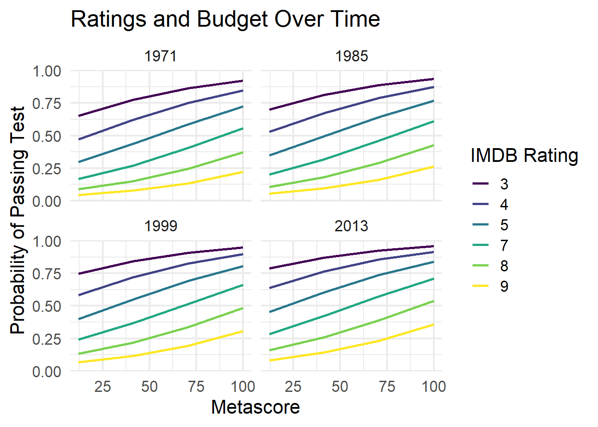

# Abstract

-   Logistic regression used to model `release year` and `genres`

-   Rating analysis examines `budget`, `IMDb user ratings`, and `Metascore` ratings across time

-   Findings show more recent movies in the *Comedy* or *Romance* genre have **higher predicted probability** of passing compared to other genres

    -   **Higher** critic ratings and **lower** user ratings = more likely to pass

# What is the Bechdel Test?

-   Created by Alison Bechdel in 1986
-   Originally a comic strip
-   Used to analyze the presence of women in movies [1]

::: {style="text-align: center;"}
Movie must contain **two named women** who have a **conversation** that is **NOT** about a *man*.
:::

**Flaws** of the Bechdel Test

-   Too simple requirements
-   Disregards which kinds of women have dialogue [2]

# Data

-   Final data set contains **10,178** movies - ranging from **1874 to 2023**

<table>
<caption>(\#tab:mytable1)IMDb Data</caption>
 <thead>
  <tr>
   <th style="text-align:center;"> Title </th>
   <th style="text-align:center;"> IMDb ID </th>
   <th style="text-align:center;"> Year </th>
   <th style="text-align:center;"> Genres </th>
  </tr>
 </thead>
<tbody>
  <tr>
   <td style="text-align:center;"> Star Wars </td>
   <td style="text-align:center;"> 76759 </td>
   <td style="text-align:center;"> 1977 </td>
   <td style="text-align:center;"> Action,Adventure,Fantasy </td>
  </tr>
  <tr>
   <td style="text-align:center;"> Grown Ups </td>
   <td style="text-align:center;"> 1375670 </td>
   <td style="text-align:center;"> 2010 </td>
   <td style="text-align:center;"> Comedy </td>
  </tr>
  <tr>
   <td style="text-align:center;"> Bullet Train </td>
   <td style="text-align:center;"> 12593682 </td>
   <td style="text-align:center;"> 2022 </td>
   <td style="text-align:center;"> Action,Comedy,Thriller </td>
  </tr>
</tbody>
</table>

*Data Source:* IMDb Non-Commercial Datasets

<table>
<caption>(\#tab:mytable2)API Data</caption>
 <thead>
  <tr>
   <th style="text-align:center;"> Title </th>
   <th style="text-align:center;"> IMDb ID </th>
   <th style="text-align:center;"> Year </th>
   <th style="text-align:center;"> Bechdel Rating </th>
  </tr>
 </thead>
<tbody>
  <tr>
   <td style="text-align:center;"> Star Wars </td>
   <td style="text-align:center;"> 76759 </td>
   <td style="text-align:center;"> 1977 </td>
   <td style="text-align:center;"> Fail </td>
  </tr>
  <tr>
   <td style="text-align:center;"> Grown Ups </td>
   <td style="text-align:center;"> 1375670 </td>
   <td style="text-align:center;"> 2010 </td>
   <td style="text-align:center;"> Pass </td>
  </tr>
  <tr>
   <td style="text-align:center;"> Bullet Train </td>
   <td style="text-align:center;"> 12593682 </td>
   <td style="text-align:center;"> 2022 </td>
   <td style="text-align:center;"> Fail </td>
  </tr>
</tbody>
</table>

*Data Source:* Bechdel Test Movie List (bechdeltest.com)

# Rating Analysis

$$
logit(\pi) = \beta_0 + \beta_1 \cdot \text{Budget} + \beta_2 \cdot \text{Year} + \beta_3 \cdot \text{IMDb Rating} 
$$

$$
+  \text{ } \beta_4 \cdot \text{Metascore}
$$

-   $\pi$ = probability of passing the test

-   $logit$ = log odds of passing the test

-   $IMDb \text{ } Rating$ = **User** ratings

-   $Metascore$ = **Critic** ratings

*Data Source*: TidyTuesday social data project (Github)

## [**Interpretation**]{.underline}

*Predicted probability* of a movie PASSING **increases** for:

-   Movies with **lower budgets**

-   Movies with **lower IMDb user ratings**

-   Movies with **higher critic ratings**

-----------------------------------------------------------------
     &nbsp;         Estimate    Std. Error   z value   Pr(>|z|)  
----------------- ------------ ------------ --------- -----------
 **(Intercept)**     -29.56       17.86      -1.655     0.09793  

 **budget_2013**   -4.733e-09   1.211e-09    -3.909    9.255e-05 

    **year**         0.0161      0.00886      1.817     0.06923  

 **imdb_rating**    -0.5709       0.1055     -5.413    6.213e-08 

  **metascore**     0.02071      0.005734     3.611    0.0003046 
-----------------------------------------------------------------

Table: Table 3: Logistic Regression Model Coefficients

# Genre Analysis

$$
logit(\pi) = \beta_0 + \beta_1 \cdot Year + \beta_2 \cdot \text{Animation} + \beta_3 \cdot \text{Action} + \beta_4 \cdot \text{Adult}
$$

$$
+ \text{ } \beta_5 \cdot \text{Adventure} +\ldots + \beta_{29} \cdot \text{Year:Western}
$$

-   $Animation$ = 1 (*yes*) or 0 (*no*)

-   $Year:Western$ = interaction term

## [**Interpretation**]{.underline}

For recent years, genres with **higher probability** of PASSING:

-   *Romance, Adventure, Comedy*

Genres with **lower probability** of PASSING:

-   *War, Western, Sport*

# Limitations

1. Data for *Rating Analysis* only contains movies up to 2013

2. Bechdel data contains most popular movies reported by users

# References

1.  Alison Bechdel, 1986. *Dykes to watch out for*. Firebrand Books.

2.  [What “The Bechdel Test” doesn’t tell us: examining women’s verbal and vocal (dis)empowerment in cinema](https://doi.org/10.1080/14680777.2016.1234239) (O’Meara, J., 2016)
